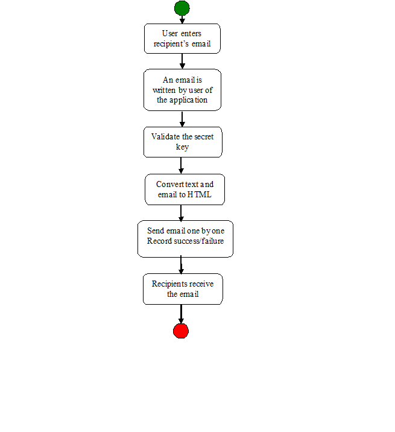

Starting a server:

A Node.js server makes your app available to serve HTTP requests. It provides the interaction between users and your application.
Creating and starting a server is easy with Node.js's built-in http module.
In a file app.js, create and save the following server-creation code:
In your terminal, run the command:
$ node app.js
and visit http://localhost:8080 in your browser.

Prototype:
The HTML content would look like below:
1)	To: will have list of email address.
2)	From : our designated email id.
3)	Subject: User will choose his subject
4)	Message: User can type a message, upload an image, Bold italic and hyperlink. Also bulleting and numbering is possible.
5)	Secret key: user will have a password to enter to send the email service.

Use-Case Model Survey

User: - is responsible for dealing with all the proceedings of the project.
a.	List of Recipients: - The user inputs all the address of the recipients for the email to be sent. 
b.	Sender’s address: - The user mentions the address in the “from” block. This can only be one address.
c.	Write content: - The user writes the body of the email positing the information to be reached to the recipients.
d.	Write subject: - The user mentions the subject of the email, which is a brief description of the body of the email for a crisp understanding of the recipients the email is all about.
e.	Upload an image: - If the user would like to add an image, he can do it through a button to add the attachment(picture) in the email. 
f.	Edit font/style: - User can make changes to the text and the alignment of the text with the use of the alignment buttons, font options and text size options available in the same page.
g.	Secret key: User inputs the secret key in order to authenticate himself for sending the email.
h.	Submit: This button is used by the user to send the email to the recipients.

Web Architecture Diagram

Use-Case Reports

User:
Name of Use Case – User of the application.

Description – the recipients receive the email sent by the user.

Pre Condition –

The user must have a password(secret key) to send the email through the application.

Normal Flow of Events – 

	User enters recipient’s email addresses.

	An email is written by user of the application.
	
	Validate the secret key.

	Convert text and image to HTML.

	Send email one by one. Record success/failure.

	The recipient receives the email.

We have estimated 45 days for the entire project to complete based on our current progress and remaining tasks.

Gnatt chart:

